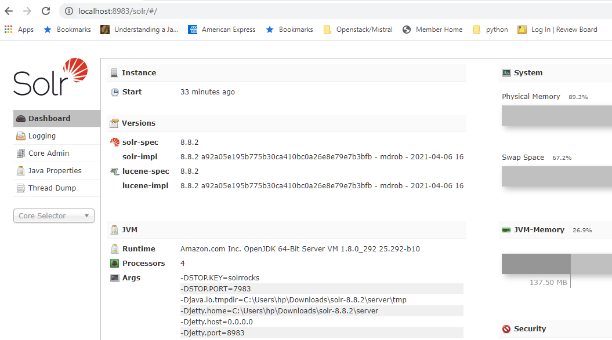
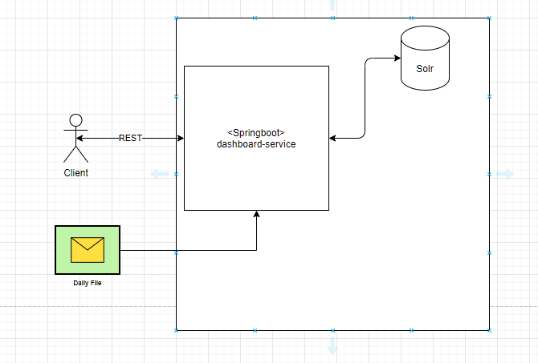
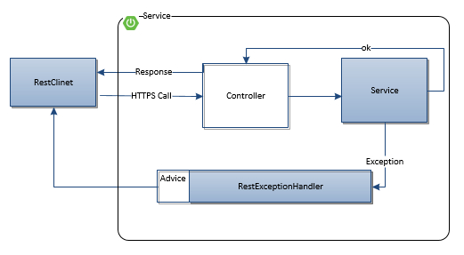
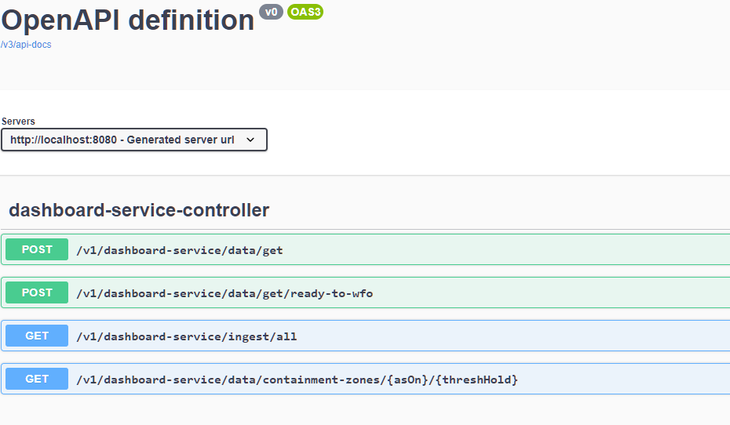
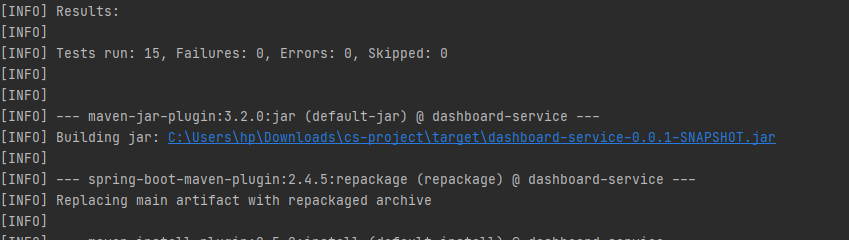

# dahsboard-service
 
Springboot and Solr based service to ingest daily data from and https://github.com/CSSEGISandData/COVID-19/tree/master/csse_covid_19_data/csse_covid_19_daily_reports and provide REST service endpoints for dashboard data.

### Build Steps
mvn clean install

### Run Steps
#### Pre requisites
    1. Start solr --> solr/bin>solr start
    2. Check admin console at http://localhost:8983/solr
    3. Configure core with schema(reference resources/schema.xml) of CSV(from git)

1. java -jar target/dashboard-service-0.0.1-SNAPSHOT -Dspring.profiles.active=dev

### System Design

#### Exception Handling

### Service Specification(OAS3.0)

http://localhost:8080/swagger-ui.html 

####Documentation:

http://localhost:8080/v3/api-docs

### Test Results

### TODO

1. Add frequency options in the /data/get service
2. Multi core Solr configuration
3. Unit test case coverage

